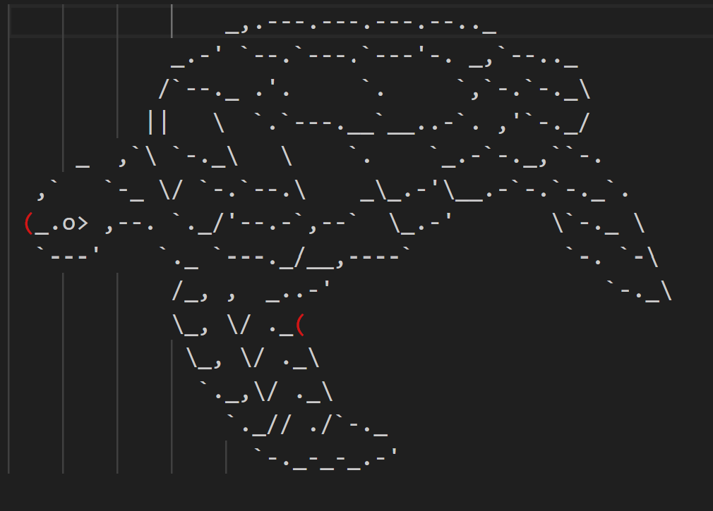

# 
 TECHXACIAL 

## 
 Future Banking Application 

   

## 
 Images 

-----------------------------------------------------------------------------------------------------------------------------

### Dark Mode

### Logo

# 
 Overview 

-----------------------------------------------------------------------------------------------------------------------------
<b> 
 This application aims to provide baking services to underbanked and unbanked populations, offering them an accessible and easy to utilize banking service. 
</b>   

# 
 Features 

<b>
User-Friendly Interface</b>: <i> Easy navigation for all users, including those with limited tech experience.</i>
 
<b>
Online Transactions</b>: <i> Support for cash transfers to accommodate users without bank accounts. </i>
 
<b>
Prepaid Card Integration</b>: <i> Option to use prepaid cards for transactions. </i>
 
<b>
Community Engagement</b>: <i> Features to connect younger audience to our service. Ease of use to Elderly and very inclusive to each unique individual</i>
 
<b>
</b>: <i> Detailed nutritional information for all baked goods. </i>
 
</b>

-----------------------------------------------------------------------------------------------------------------------------

# 
 Contact Us 

<i> Reach out to us via community post :D! </i>

